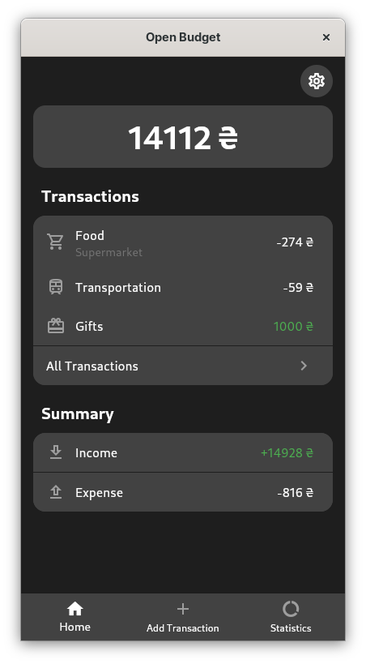
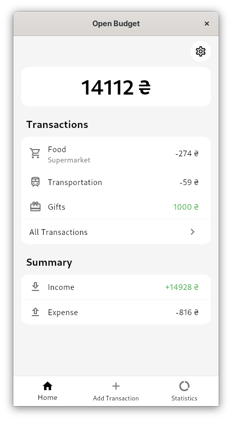

# Open Budget
Open Budget is open-source, cross-platform budgeting application 

# Screenshots
<p align="left">
    
    
</p>

# Features

### Transaction management
- Add income and expense transactions
- Organize transactions with categories
- Edit or remove transactions

### History
- Transactions grouped by date 
- Full transaction history in one place
- Filter transactions by income or expense 

### Statistics
- See top income and expense categories on Statistics page
- Total income and expense summary on Home page 

### UI
- Light and dark theme


# Getting started 

## Install from Releases
1. Go to the **Releases** page:
```
https://github.com/atomi19/open_budget/releases
```
2. Download the latest installation file for your platform (e.g. APK for Android)
3. Install it on your device

## Build from Source
### Requirements
- Flutter SDK

### Dependencies
- [Drift](https://pub.dev/packages/drift)
- [shared_preferences](https://pub.dev/packages/shared_preferences)

### Setup
1. Clone the repo:
```bash 
git clone https://github.com/atomi19/open_budget.git
```

2. Navigate to the project directory:
```bash
cd open_budget
```

3. Get dependencies:
```bash
flutter pub get
```

4. Database setup (this will generate database.g.dart):
```
dart run build_runner build
```

5. Run the project on mobile (ios, android) or desktop (linux, windows, macos)
```
flutter run
```

# License
This project is licensed under the [GNU GENERAL PUBLIC LICENSE Version 3](LICENSE.txt)